- [TOC]

# 绪论

​	值班安排系统，后端 JAVA 服务遵从基于 Maven 的 spring boot 微服务架构标准，采取 MVC 设计模式. Python 服务使用基于 WSGI 规范的 wsgiref 服务器，采取抽象工厂模式实现动态服务功能， 采取装饰器模式进行权限验证.

## 研究基本内容

- 研究值班人员安排算法. 针对复杂情况的大规模人员安排，实现值班人数，值班起始日期，计划通知日期的调整. 寻求多种值班安排计划的最优解. 
- 基于python开源项目的智能节假日处理模块. 利用开源项目[^chinesecalendar]数据库有效解决节假日等特殊情况下人员安排，参与并维护相关开源项目，保障系统运行的稳定性. 
- 数据库选择和表关系探索. 选择适合的企业级数据库并构建高效表结构以降低对服务器性能要求，力求适应高校等组织低带宽，低配置，低成本，低并发的内网使用环境. 
- 研究并设计权限管理系统. 设计相关权限管理以防止值班计划和安排的无序更改. 
- 任务调度底层系统实现. 利用开源框架实现基于Windows服务器任务调度系统，支撑上层系统并行，记录日志，溯源错误. 
- 研究移动设备web网页适配的可行性. 
- 研究网站安全与鲁棒性. 
- 对主流组织管理工具的适配和功能扩展.

[^chinesecalendar]:[LKI/chinese-calendar: 查看节假日安排 (github.com)](https://github.com/LKI/chinese-calendar)

## 拟解决的主要问题和最终目标  

根据任务调度和值班安排的现有研究成果，在全面考察学校疫情防控方案的情况下，结合云技术和5G通讯技术，综合考虑校园环境访问情况，学校现行组织管理工具——钉钉以及正在开展的校内资源整合计划等因素，拟解决以下问题:
- 人工计划值班安排不够高效
- 计划通知不及时，信息传达延后
- 节假日等特殊情况的人工干预
- 值班计划查阅，更新繁琐，信息更新滞后
- 师生对于新信息通知方式的接纳程度较低
- 人员权限设计和不同权限人员的动态路由规划

本项目拟分值班安排分析和消息通知分析两部分，辅以权限管理，任务调度系统，服务公告，系统变量，钉钉机器人等模块. 首先对人工排班和通知情况重新审视，深入分析该模式下人力消耗，时间成本和可靠性，然后通过值班表资源消耗，值班信息传递时效性，值班信息通知覆盖率等方面与其相关的半人工值班安排进行异同比较，最后归纳各值班安排的类型，得出随着人员参与度越低，成本与可靠性越高的启示. 本项目的研究重点是全自动化情况，拟设定本项目目标为:

- 完全基于云端/服务器的信息编织，发布，修改，更新
- 轻量化的系统，力求降低对服务器和网络资源的要求，降低部署成本
- 通过现有工具的消息发送，系统接入钉钉和企业微信端口，通过钉钉或企业微信消息通知. 
- 无需维护/监督的自动化解决方案
- 简单易学的计划生成工具. 
- 针对各部门特殊需求的个性化信息通知模板

# 项目核心设计说明

## 组别设计

组别信息数据表有GROUP_NAME和GROUP_DESCRIPTION字段. 

GROUP_DESCRIPTION字段为组别描述字段，对组别进行功能性描述.

GROUP_NAME字段设计位共10位，当前使用三位. 每个组别均设置一个字符串进行指代. 项目初始组别有:100 后台系统开发组，150 任务调度开发组等.

## 权限设计

本项目采取用户、角色、权限的权限控制传递方式. 

每个组别设计多个角色，如管理员、普通组员. 将角色与权限相对应，再根据用户情况设置其角色，即可做到权限控制. 特别的，若不想让用户成为某个角色，但是又需要该角色的部分权限，可以通过用户特权表设置. 

这样设计可以对用户群体进行划分，批量设置权限. 修改角色权限时，可以做到面向特定用户群体的统一修改，做到泛化的权限控制. 

			<!--块级封装-->
    
	<!--将图片和文字居中-->
    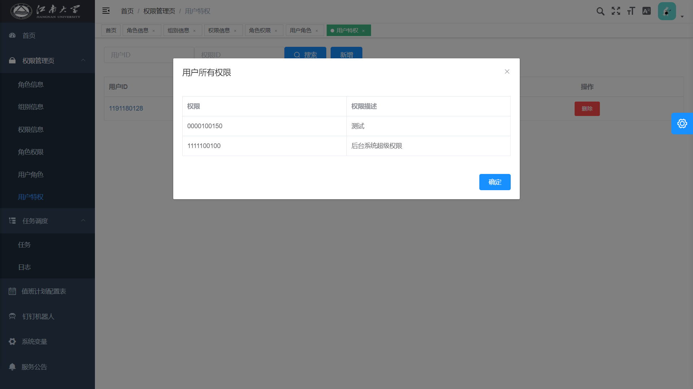
     		<!--换行-->
    图1 用户特权页面	<!--标题-->
    

### 角色设计

角色信息数据表有CHARACTER_ID和CHARACTER_DESCRIPTION字段. 

CHARACTER_DESCRIPTION字段为角色描述字段，对角色进行功能性描述.

CHARACTER_ID字段设计位共10位，当前使用位为5位.  其中前三位为组别信息，表明角色所属组别，以便为其进行权限设置. 后两位为角色序号，以便对同组角色进行区分. 

例如:

- 20001 值班系统开发组01号角色
- 16001 钉钉机器人开发组01号角色
- 15001 任务调度开发组01号角色
- 10001 后台系统开发组01号角色

演示图如下:

			<!--块级封装-->
    
	<!--将图片和文字居中-->
    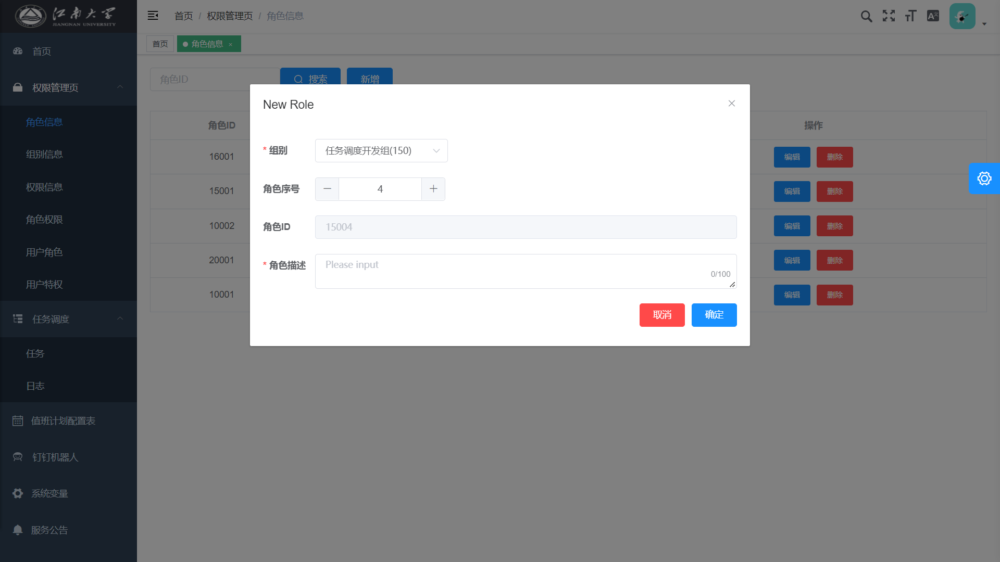
     		<!--换行-->
    图2 角色信息页面	<!--标题-->
    

### 权限设计

权限信息数据表有AUTHORITY_ID和AUTHORITY_DESCRIPTION字段. 

AUTHORITY_DESCRIPTION字段为权限描述字段，对权限进行功能性描述.

AUTHORITY_ID字段设计位共10位，当前使用位为10位.  其中前五位为IO权限，表明权限是否能够进行删除、修改、创建、群体查询和读取的IO操作，中间两位为待定位，便于后期迭代扩充，后三位为权限组别信息. 

其中群体查询IO权限是为了控制能否查询不属于自身的数据，比如/getAllOnDutyInfo接口的作用是查询所有值班计划，若用户没有该权限则只能查看自己创建的值班计划；读取权限是默认点亮的，以保证前端数据正常显示.

AUTHORITY_ID字段格式:

​	IO权限（占5位）+待定位（占2位）+权限对应角色组（占3位）

​	AUTHORITY_ID前五位分别对应删除、修改、创建、群体查询、读取五种IO权限. 

例如:

- 1111100200 该权限可以完全控制值班系统所有接口.
- 1111100150 该权限可以完全控制任务调度系统所有接口.
- 1111100100 该权限可以完全控制后台系统所有接口.

用户登录成功后，后端将权限列表编入令牌中，每次请求时携带令牌，后端进行解码验证:先进行角色组验证，若不符合则不可以操作该组的接口函数，之后进行IO权限验证，判断不同类型接口的函数调用情况. 

演示图如下:

			<!--块级封装-->
    
	<!--将图片和文字居中-->
    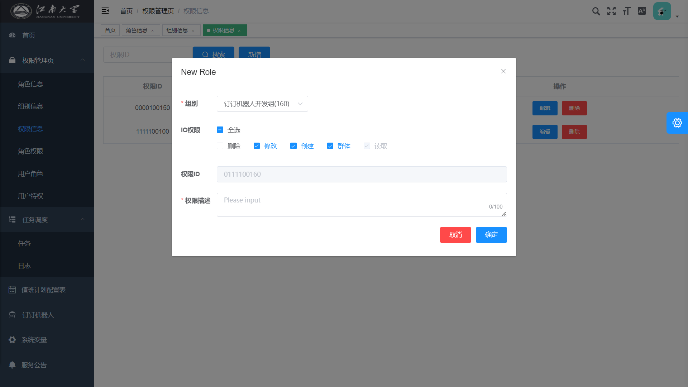
     		<!--换行-->
    图3 权限信息页面	<!--标题-->
    

### 数据库实体关系

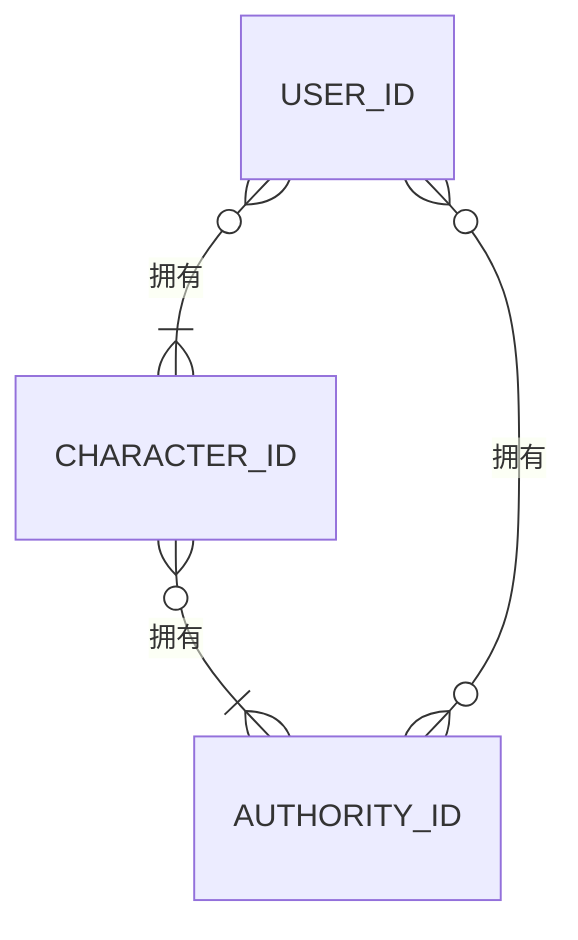
```mermaid
erDiagram
    CHARACTER_ID }o--|{ AUTHORITY_ID : "拥有"
    USER_ID }o--o{ AUTHORITY_ID : "拥有"
	USER_ID }o--|{ CHARACTER_ID : "拥有"
```
## 前端鉴权与令牌(token)选择

本项目基于前后端分离的设计标准开发，通过超文本传输协议请求（HTTP）进行消息传递. HTTP是无状态的，请求和响应方无法维护，但是出于安全需要必须进行状态维护，所以每次请求都需要认证或是标记. 

大多状态管理方案都基于身份凭证信息（Cookie），作为一种完善的经典标记方式，Cookie通过HTTP请求头和源代码操作并有自己的安全策略. 

### 会话保持技术（Session）

目前主流状态管理方案是服务端会话保持. 

一个比较经典的会话保持流程:

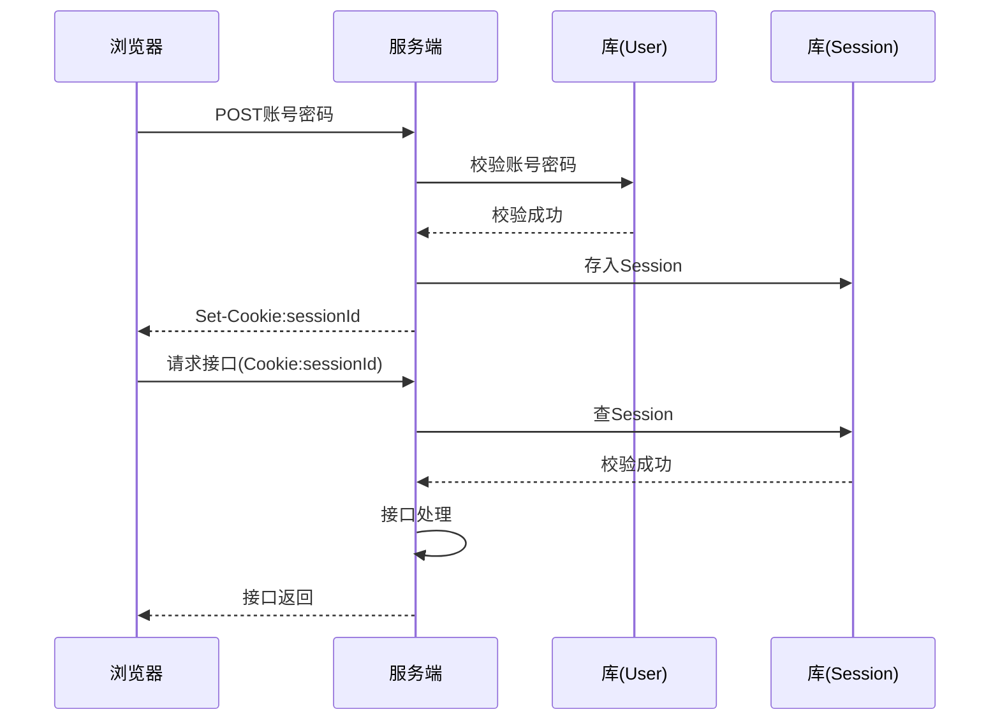
```mermaid
sequenceDiagram
	participant l as 浏览器
	participant f as 服务端
	participant db as 库(User)
	participant se as 库(Session)
	l->>f: POST账号密码
	f->>db: 校验账号密码
	db-->>f:校验成功
	f->>se:存入Session
	f-->>l:Set-Cookie:sessionId
	l->>f:请求接口(Cookie:sessionId)
	f->>se:查Session
	se-->>f:校验成功
	f->>f:接口处理
	f-->>l:接口返回

```

服务端把用户登陆状态存入会话保持数据库中并生成一个SessionID. 请求响应接口时利用Cookie携带SessionID进行数据查询然后校验. 会话保持技术一般利用Redis内存数据库进行快速查询. 用户登陆状态过期或主动注销时在数据库中进行数据销毁. 但是这种方案对于服务器要求较高，一旦会话保持服务器宕机，会丢失所有会话状态. 并且对每个用户进行会话保持，对内存要求较高. 另外，针对会话保持技术的欺骗攻击[^sess]会对网站造成危害. 综上不适用本项目. 

### 令牌验证模式（Token）

会话保持技术对于服务端是很困难的，需要使用额外的数据库，对于大访问量网站，甚至要进行分布式部署或是Redis服务集群. 这对于内网web项目而言成本过高. 所以本项目使用无状态的令牌验证模式进行前端鉴权. 用户登陆时服务端将必要的HTTP请求信息进行加密编码作为令牌随响应传回前端，每次接口请求时携带令牌. 后端进行解密验证权限和有效期. 

本项目使用JWT标准[^JWT]进行令牌加密，符合OAthu2.0[^oathu]认证标准. 优点是无需数据库的介入，基于JWT令牌的认证服务器会将用户信息存入令牌，资源服务获取令牌后可以解码出对应信息，也适用于微服务[^微服务]场景，并且将JWT随请求头携带，可用于跨域环境. 

但是鉴于令牌验证模式的无状态特点，令牌一旦给出，后端服务无法主动停止授权. 并且服务端密钥流出则会让所有JWT令牌处于可篡改状态. 这些缺点可以使用数据库令牌（Redis-Token）模式解决，将令牌存入Redis服务器，每次接口请求进行有效期查询和验证. 

另一种解决方案是令牌刷新模式（Refresh Token[^re]）. 使用两套令牌:业务接口令牌（access token）和刷新令牌（refresh token）. 业务接口令牌时效足够短以保障高权限业务. 但过短的业务接口令牌时效会需要用户频繁获取，对于用户来说不够友好. 所以令牌刷新模式模式应运而生. 使用刷新令牌来重置业务接口令牌时效，业务接口令牌作为给出前端业务接口凭证，安全性有效提高. 过期后使用请求方式更宽松的刷新令牌再次获取. 刷新令牌时效足够长，可以和会话保持技术一样处理. 

但是令牌刷新模式使用了数据库，违背了JWT标准不需数据存储的设计初衷. 频繁的令牌刷新和生成，以及双令牌传输，不仅增加了网络传输的压力，还造成了较高的服务器资源占用，这些违背了本项目的设计原则. 综合以上和本项目的内网使用环境，决定使用JWT标准进行前端鉴权. 

令牌刷新模式请求流程如下:

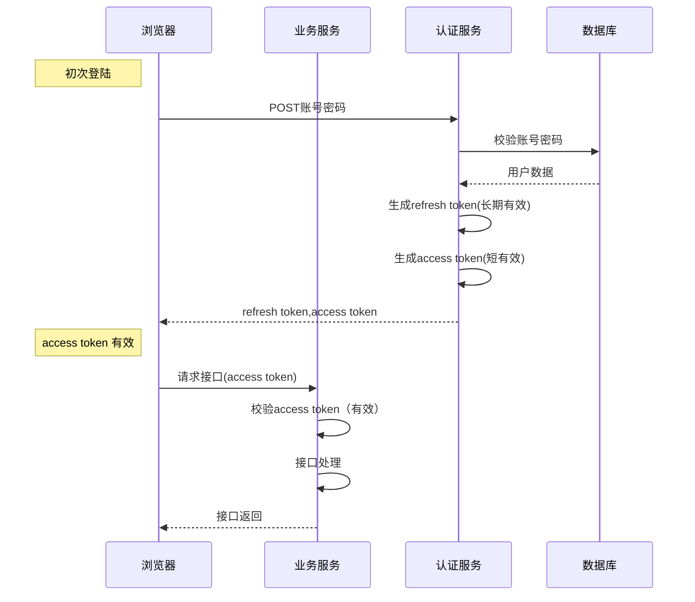
```mermaid
sequenceDiagram
    participant l as 浏览器
    participant y as 业务服务
    participant r as 认证服务
    participant db as 数据库
    Note left of l: 初次登陆
    l->>r: POST账号密码
    r->>db: 校验账号密码
    db-->>r: 用户数据
    r->>r: 生成refresh token(长期有效)
    r->>r: 生成access token(短有效)
    r-->>l: refresh token,access token
    Note left of l: access token 有效
    l->>y: 请求接口(access token)
    y->>y: 校验access token（有效）
    y->>y: 接口处理
    y-->>l: 接口返回
```

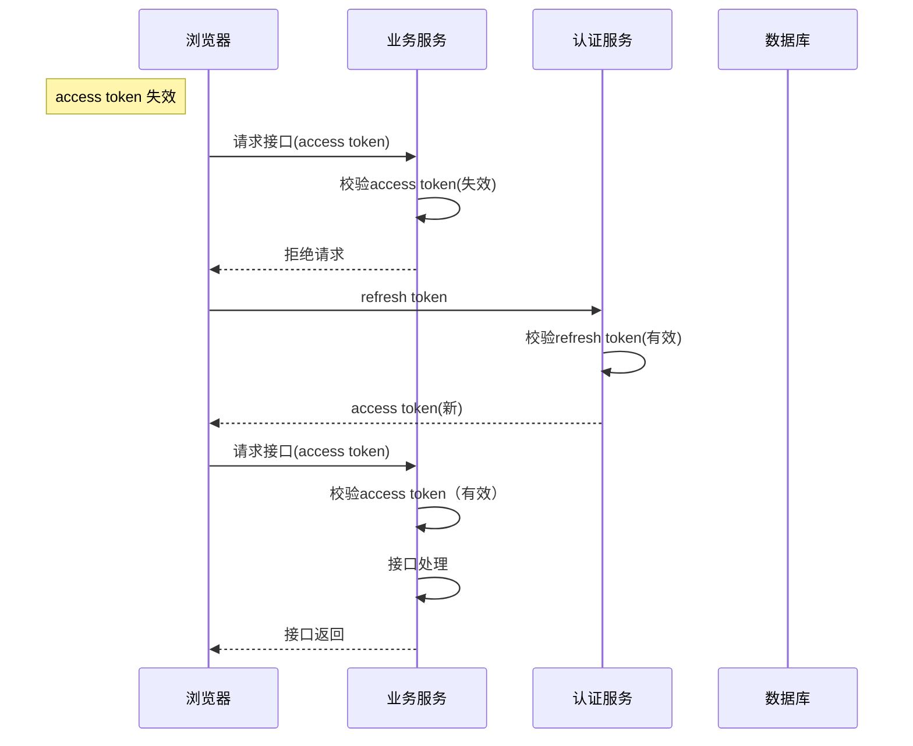
```mermaid
sequenceDiagram
    participant l as 浏览器
    participant y as 业务服务
    participant r as 认证服务
    participant db as 数据库
    Note left of l: access token 失效
    l->>y: 请求接口(access token)
    y->>y: 校验access token(失效)
    y-->>l: 拒绝请求
    l->>r: refresh token
    r->>r: 校验refresh token(有效)
    r-->>l: access token(新)
    l->>y: 请求接口(access token)
    y->>y: 校验access token（有效）
    y->>y: 接口处理
    y-->>l: 接口返回
```

[^oathu]: 时子庆,刘金兰,谭晓华. 基于OAuth2.0的认证授权技术[J]. 计算机系统应用,2012,21(3):260-264. DOI:10.3969/j.issn.1003-3254.2012.03.061. 
[^sess]:  孙天昊,陈飞,邓俊昆. 一种基于cookie会话保持的LVS集群系统[J]. 计算机应用研究,2013,30(4):1102-1104. DOI:10.3969/j.issn.1001-3695.2013.04.038. 
[^re]: AMAZON TECHNOLOGIES, INC.. Refresh token for credential renewal:US14972676[P]. 2020-02-18. 
[^JWT]:RFC 7519 - JSON Web Token
[^微服务]:史正茂,许友军. 浅谈微服务[J]. 电脑知识与技术,2020,16(14):117,119.
## 动态路由与权限验证

### 路由划分

路由和权限验证是组织起一个应用的关键框架. 本项目的路由和权限验证相关联，对于不同的用户，配置相应权限之后动态生成路由. 

本项目路由分为两种:

- 不需要动态权限判定的路由. 如登陆页面，404页面.

- 需要权限判断并通过Vue-Router addRoutes 方法动态添加的路由，如任务调度页面.

### 权限验证

#### 页面级别和后端权限控制

前端进行页面级的控制. 设置访问每一个路由所需的权限，用户登录之后，从token中获取用户权限，动态计算该用户的路由表，之后通过router.addRoutes挂载，再辅以一些按钮级别的权限控制，完成整个前端权限控制. 此外，鉴于前端几乎明文的生产环境，前端会在每一个请求的请求头中添加用户令牌，服务器根据令牌判断用户操作该接口的合法性. 从而在页面遭到篡改的情况下保证操作安全. 

目前也有后端直接传入路由表，再动态生成侧边栏的方式. 本项目不采用该方式，主要是因为项目作者独立开发，前后端交替迭代. 前端页面开发需要后端先行配置路由和权限，不符合前后端分离开发的标准. 再者，后端权限验证根据业务/组别划分. 辅以增删改查等IO权限，对于相同组别而不同IO权限的用户，均可进入对应页面. 故而采用前端动态生成路由表和后端接口验证的设计模式. 

#### 按钮级别权限控制

由于本项目颗粒度权限判断交由后端完成，前端需要按钮级判断的地方不是很多. 在对应业务页面，根据IO权限划分为删改增读和群体数据读取五项，一般使用v-if手动区别不同权限对应按钮. 若是后期迭代，可以参考路由层面制作动态IO权限配置表. 

#### 拦截器

前端使用axios完成异步javascript和XML(Ajax)请求. 针对不同的后端服务器，封装了对应的axios实例，从而请求不同的api地址. 并且，每个axios实例都配置了request拦截器，在请求头中添加令牌，并且响应处理前后端约定格式的服务器返回数据. 

java后端使用重写Spring Boot org.springframework.web.servlet.HandlerInterceptor接口的拦截器[^1]，拦截器会处理token并向权限验证系统传递请求，从而完成java后端权限验证. 

python后端在wsgiref application监听方法中提取令牌进行验证，然后传递请求到接口函数，接口函数配置的装饰器完成权限验证. 

[^1]: 张家福,张新荣,焦红爱. WebWork2中的Interceptor机制研究[J]. 计算机工程与设计,2007,28(3):566-568,641. DOI:10.3969/j.issn.1000-7024.2007.03.024. 

### 本节流程图如下:

			<!--块级封装-->
    
	<!--将图片和文字居中-->
    
     		<!--换行-->
    

# 项目功能与效果实现

## 功能总览

- 登录/注销
- 权限验证
  - 角色配置
  - 权限配置
  - 角色权限配置
  - 用户角色配置
  - 用户特权配置
- 全局
  - 前端页面级动态路由
  - 前端动态面包屑栏
  - 前端快捷导航(标签页)
  - 前端mock数据
  - ScreenFull全屏
  - 可调节布局大小
  - 中文环境菜单支持拼音搜索
  - 导出Excel
  - i18n国际化
- 错误页面
  - 401
  - 404
- Dashboard
  - 用户每周操作次数统计
  - 日历面板显示值班安排
  - 当日值班看板
  - ToDo 看板
- 个人中心
  - 公告展示栏
    - 纯文本
    - 富文本
    - 走马灯
  - 时间线
  - 个人信息修改
- 任务调度管理
- 值班计划管理
- 钉钉机器人管理
- 系统变量管理
- 服务公告管理

## 首页与导航菜单

首页作为web项目的门户网页，一般作为信息载体直观的向用户呈现. 

首页分为操作频次曲线图，值班日历，今日值班看板，待办清单和个人卡片五部分. 

曲线图提取记录在本地存储（localStorage）中用户不同时间操作网页时发送的http请求数量，绘制折线图，直观的呈现用户在一周不同时间对网站访问频率；值班日历以日历形式展示所有值班任务的值班安排，通过点击可以在左侧唤出抽屉栏，各个值班安排以手风琴折叠面板形式展出，并且可以替换未来的值班安排；待办清单可以管理代办事项，并且可以进行筛选. 

导航菜单在中文模式下可以根据拼音查询网页按钮并直接跳转页面，还有全屏、布局大小、i18n语言切换按钮以及个人中心入口. 

演示图如下:

			<!--块级封装-->
    
	<!--将图片和文字居中-->
    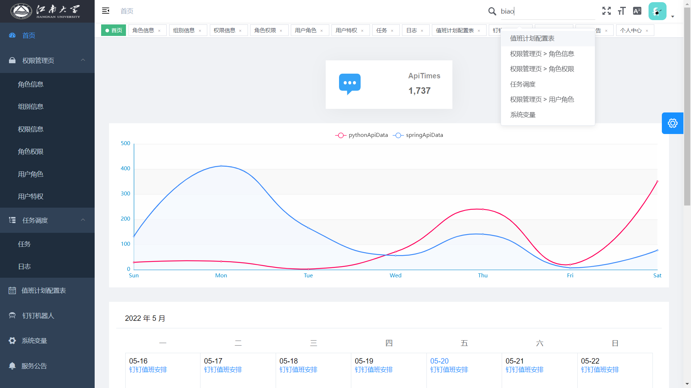
     		<!--换行-->
    图4 首页	<!--标题-->
    

			<!--块级封装-->
    
	<!--将图片和文字居中-->
    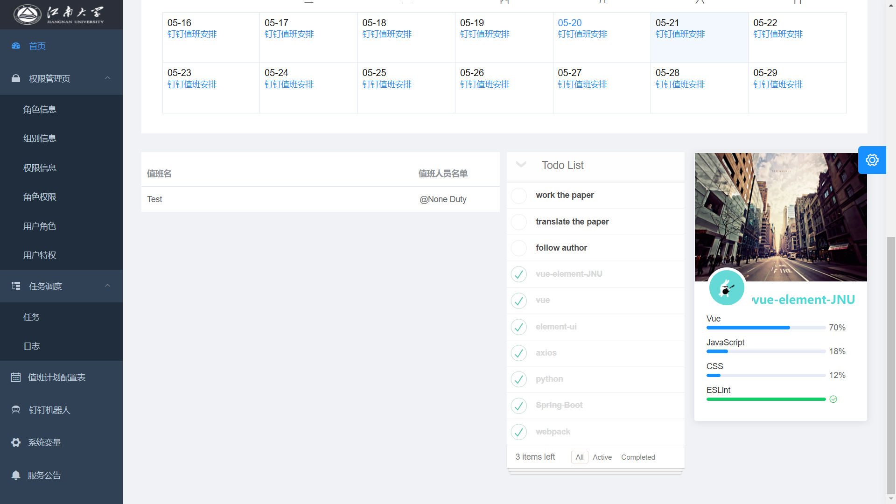
     		<!--换行-->
    图5 首页	<!--标题-->
    

			<!--块级封装-->
    
	<!--将图片和文字居中-->
    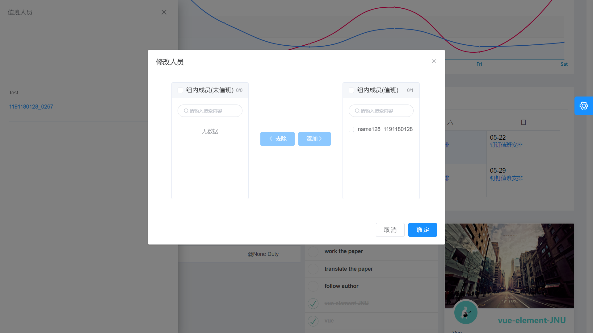
     		<!--换行-->
    图6 首页	<!--标题-->
    

			<!--块级封装-->
    
	<!--将图片和文字居中-->
    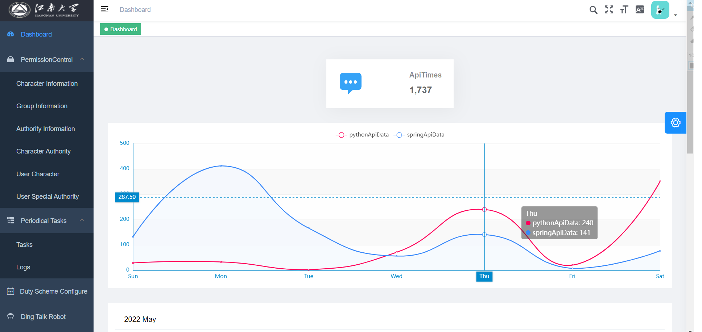
     		<!--换行-->
    图7 首页	<!--标题-->
    

## 任务调度

任务调度系统是基于Quartz开源作业调度框架搭建的自动化系统. 可以执行Java服务端除私有方法外（包括静态方法）的所有特定参数类型方法以及CMD命令，可用于执行python脚本. 

系统变量功能的支持可以让任务调度系统做到动态调整任务扫描频率，调节服务器压力，搭配cron表达式可以灵活设置任务调度时间. 

java服务系统启动后，利用重新ApplicationRunner接口的run方法进行动态配置的频率循环扫描数据库任务. 然后使用多线程调度任务处理器并行处理任务到新加调度、删除调度、更新调度、暂停调度和开始调度五个任务组，之后并行处理各个调度组任务. 

Quartz默认开启了十个线程池，可以同时处理十个调度任务. 系统会对新加调度进行类型判断，对于本机接口类型会验证参数合法性，之后根据类型调用重写Job接口的MyJob类或MyCmd类，使用UUID对每个任务生成一个同一时空中的唯一识别码，并根据cron表达式生成触发器，最后加入调度列表进行调度. 

任务调度系统依赖任务调度注册表(DCTIMEDTASKREGISTER)和任务调度日志表(DCTIMEDTASKLOG). 每轮任务调度结束，系统会将关键日志记录进任务调度日志表（DCTIMEDTASKLOG）方便观察运行情况. 

部分流程时序图如下:

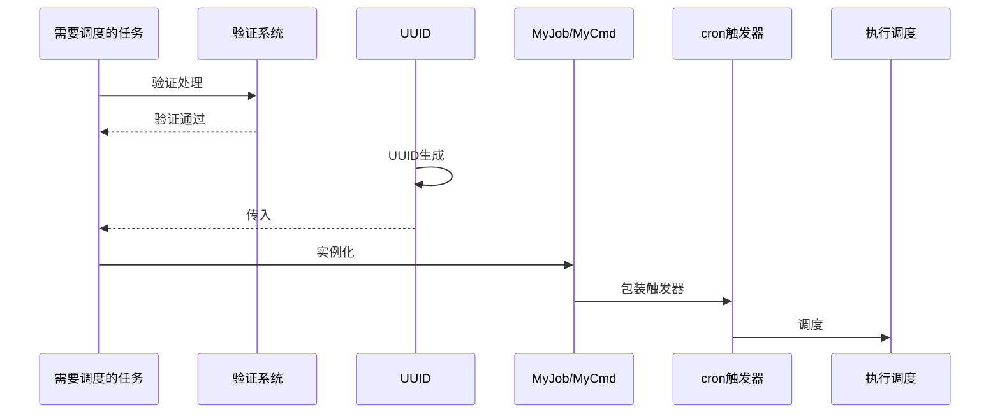
```mermaid
sequenceDiagram
	participant task as 需要调度的任务
	participant val as 验证系统
	participant uu as UUID
	participant job as MyJob/MyCmd
	participant cron as cron触发器
	task->> val:验证处理
	val-->> task:验证通过
	uu->>uu: UUID生成
	uu-->>task: 传入
	task->>job: 实例化
	job->>cron:包装触发器
	cron->>执行调度:调度
```

演示图如下:

			<!--块级封装-->
    
	<!--将图片和文字居中-->
    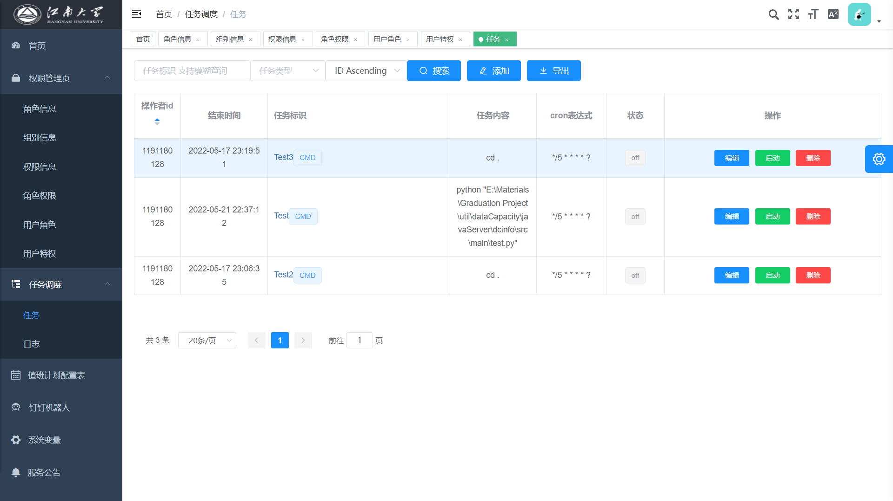
     		<!--换行-->
    图8 任务调度页面	<!--标题-->
    

			<!--块级封装-->
    
	<!--将图片和文字居中-->
    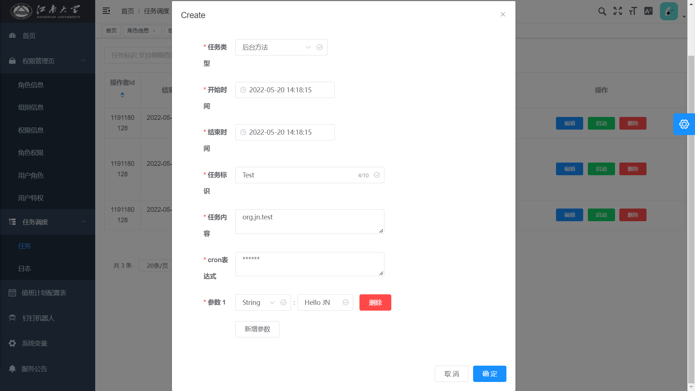
     		<!--换行-->
    图9 任务调度页面	<!--标题-->
    

			<!--块级封装-->
    
	<!--将图片和文字居中-->
    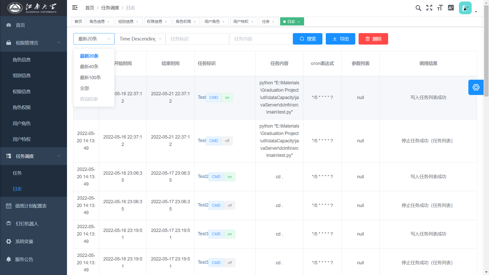
     		<!--换行-->
    图10 任务调度页面	<!--标题-->
    

			<!--块级封装-->
    
	<!--将图片和文字居中-->
    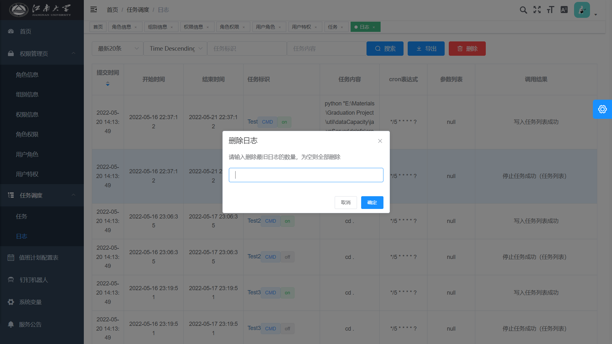
     		<!--换行-->
    图11 任务调度页面	<!--标题-->
    

## 值班任务

值班任务是一个基于任务调度的自动化值班安排，更新和通知系统. 

分为值班计划配置、钉钉信息转录、值班计划生成、值班计划填充、钉钉消息通知、日志装饰器、系统运行和对外接口九个模块. 

通过配置可以做到智能跳过法定节假日、设置自定义节假日、设置周值班安排发布日、发送钉钉通知和更改值班安排等功能. 

新建值班任务会立即进行初始化，生成值班安排并存入临时值班表. 日常运行时根据配置判断是否应该通知值班和进行新的值班计划生成，一般生成两周的值班安排，每周更新日进行更新，保留原有计划第一周之后的安排以保留人为更改. 

### 表结构说明

值班系统依赖数据表:值班表(DCONDUTY)和临时值班表(DCTMPONDUTY). 

临时值班表(DCTMPONDUTY)中存放值班系统生成的各个值班任务的值班安排. 在用户或日常发送值班通知时查询或更改. 

| 字段名          | 描述                                                         |      |
| :-------------- | :----------------------------------------------------------- | ---- |
| duty_now        | 存放周更新日前一天最后一位值班人员，以便更新值班安排时符合值班人员顺序. |      |
| duty_people     | 存放格式为  姓名1\_员工号1,姓名2\_员工号2,姓名3_员工号3  的值班人员列表，生成值班安排时按照该字段内容进行安排. |      |
| auto_skip       | 数据类型是 number ，设为1则跳过法定节假日，0则不跳.          |      |
| self_holiday    | 存放格式为0,1,2,3,4,5,6的自定义节假日列表，优先级高于法定节假日，不受auto_skip字段控制. ‘0’为周一，类推，可多选 . |      |
| pub_notice_week | 存放周值班计划发布日期. 数据类型是 number  1为周一，类推.  若auto_holiday字段设为1  则出现0选项 表示每周第一个工作日. |      |

### 时序图与演示图

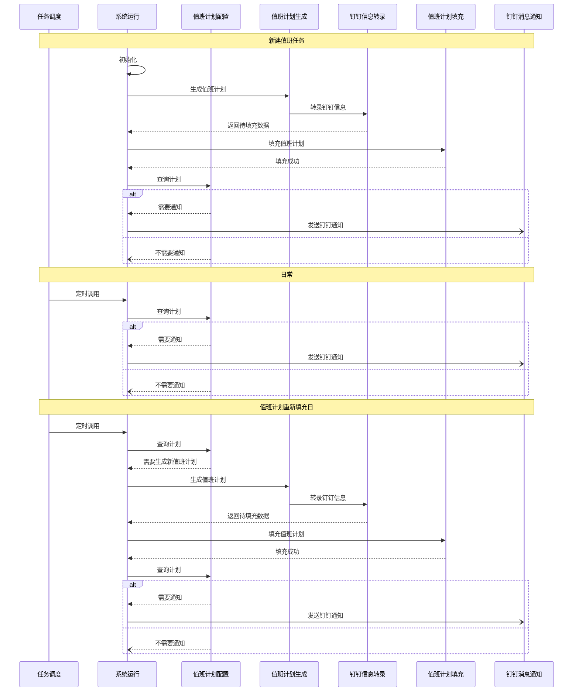
```mermaid
sequenceDiagram
	participant time as 任务调度
	participant sys as 系统运行
	participant info as 值班计划配置
	participant build as 值班计划生成
	participant ding as 钉钉信息转录
	participant pad as 值班计划填充
	participant msg as 钉钉消息通知
	Note over time,msg:新建值班任务
	sys->>sys: 初始化
	sys->>build:生成值班计划
	build->>ding: 转录钉钉信息
	ding-->>sys:返回待填充数据
	sys->>pad:填充值班计划
	pad-->>sys:填充成功
	sys->>info:查询计划
	alt
	info-->>sys:需要通知
	sys-)msg:发送钉钉通知
	else
	info--)sys:不需要通知
	end
	Note over time,msg:日常
	time->>sys: 定时调用
	sys->>info:查询计划
	alt
	info-->>sys:需要通知
	sys-)msg:发送钉钉通知
	else
	info--)sys:不需要通知
	end
	Note over time,msg:值班计划重新填充日
	time->>sys: 定时调用
	sys->>info:查询计划
	info-->>sys:需要生成新值班计划
	sys->>build:生成值班计划
	build->>ding: 转录钉钉信息
	ding-->>sys:返回待填充数据
	sys->>pad:填充值班计划
	pad-->>sys:填充成功
	sys->>info:查询计划
	alt
	info-->>sys:需要通知
	sys-)msg:发送钉钉通知
	else
	info--)sys:不需要通知
	end

	
```

			<!--块级封装-->
    
	<!--将图片和文字居中-->
    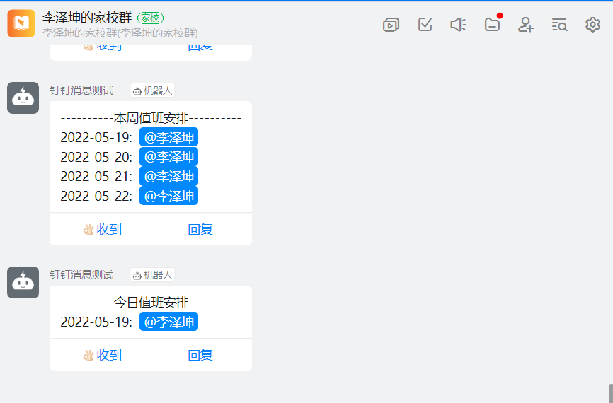
     		<!--换行-->
    图12 值班系统页面	<!--标题-->
    

			<!--块级封装-->
    
	<!--将图片和文字居中-->
    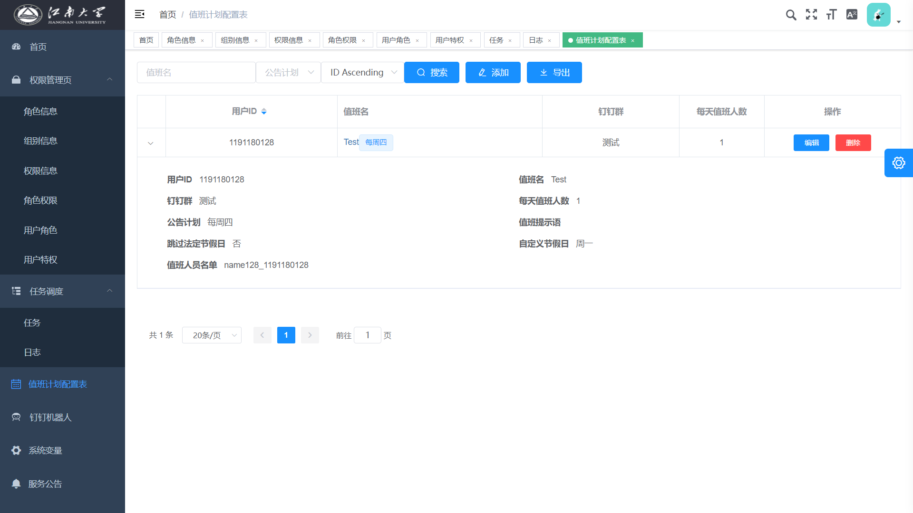
     		<!--换行-->
    图13 值班系统页面	<!--标题-->
    

			<!--块级封装-->
    
	<!--将图片和文字居中-->
    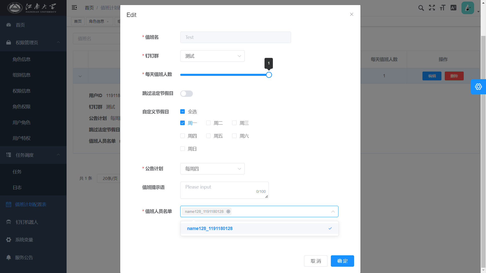
     		<!--换行-->
    图14 值班系统页面	<!--标题-->
    

## 任务调度系统调度值班任务流程图

[](https://mermaid-js.github.io/mermaid-live-editor/edit#pako:eNqNUctKw0AU_ZVhFqLQ1H2RLKQuBFfqzhQZkkkbTSYlmSAlDdSVbamIz4oPSoRiELQFRaFV-jOZSfwL06YtiBuHWQx3zuPec10omwqGOajq5oFcQhYFG5sSkaji0MpWxXZZ7TM6eY5eh9Gw4wEgCCIwkEZUh8hi-hf7Aau_h193PPDZfbuwImQB73Tj3sMyv33jV32QzQpiGVu2SdaJauZXdxb3yC6ybUzDwYCdXocjnx_2-GWfH7-wwflSQSIgOdMWJp55jRQnnt9njfGt3USd7tQQzA3_OKVCM3ICFMRqyq0CJaluI33fdVPN6CLg9Q_PSznIoeZ4_vjoiTUD1rr6FQGSqWamIYTDIWv6vPEY-61ZQwtAN4sib3fZqP3vVKa-c-VJs6ludZYFzEADW8kClGRl7pghQVrCBpZgLnkqWEWOTiUoES-BOmUFUbymaNS0YE5Fuo0zMB2MyDBHLQfPQHkNFS1kTFHeD9xo86o)

## 服务公告

服务公告功能可以进行系统公告设置，以通知需要全体用户可以看到的消息，分为三种类型:纯文本、富文本和走马灯. 

三种形式均可以设置关键词，HTTP链接和公告文本. 纯文本类型将内容作为文本展示；富文本则将其中的图片链接显示出来；走马灯类型则会忽略公告文本内容，将图片链接以走马灯卡片形式展示出来，所有公告在个人中心页以卡片形式展示. 

公告功能依赖服务公告信息表(dcservernotice)，其中server_type字段存放公告类型以供前端进行不同格式渲染，keywords和httpinfo字段以列表字符串形式存放关键词和http链接. 

			<!--块级封装-->
    
	<!--将图片和文字居中-->
    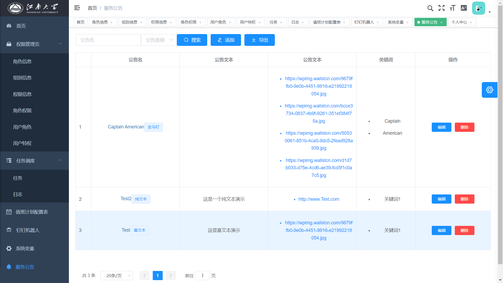
     		<!--换行-->
    图15 服务公告页面	<!--标题-->
    

			<!--块级封装-->
    
	<!--将图片和文字居中-->
    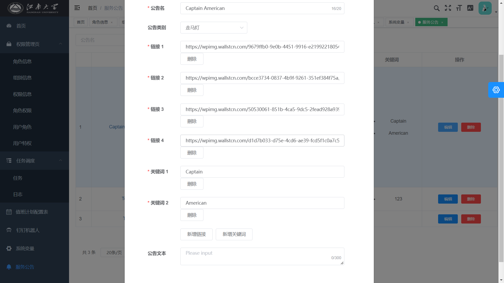
     		<!--换行-->
    图16 服务公告页面	<!--标题-->
    

## 个人中心

个人中心页面分为两个卡片组. About me卡片组展示个人介绍和头像，另一个卡片组分为Notice、TimeLine和Account三块，分别展示服务公告，时间线和个人信息. 

			<!--块级封装-->
    
	<!--将图片和文字居中-->
    
     		<!--换行-->
    图17 个人中心页面	<!--标题-->
    

			<!--块级封装-->
    
	<!--将图片和文字居中-->
    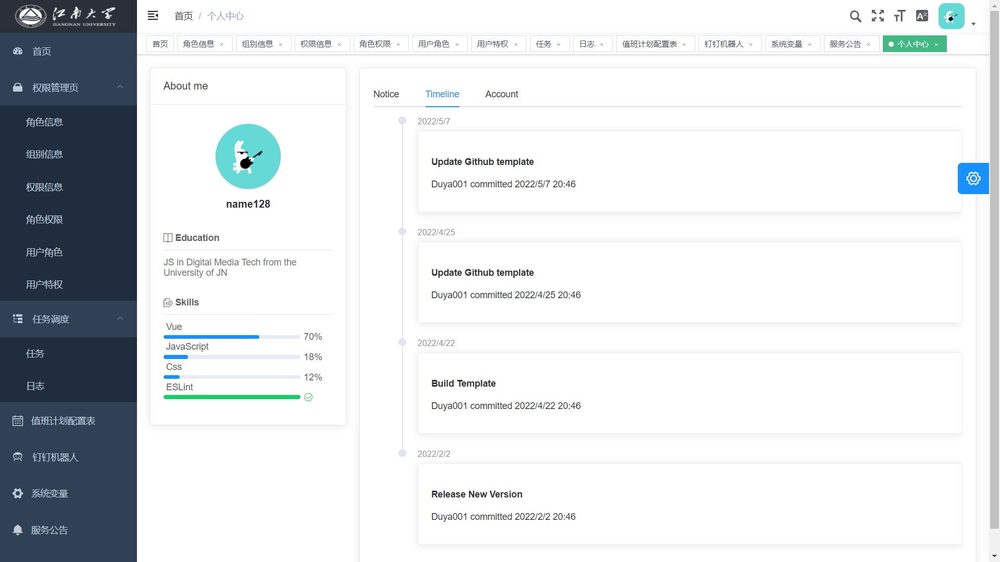
     		<!--换行-->
    图18 个人中心页面	<!--标题-->
    

			<!--块级封装-->
    
	<!--将图片和文字居中-->
    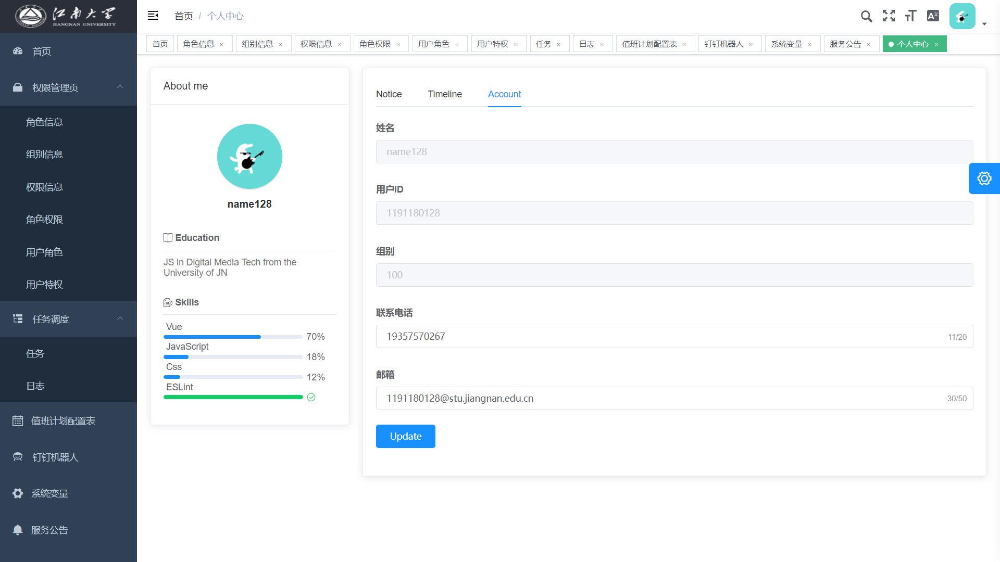
     		<!--换行-->
    图19 个人中心页面	<!--标题-->
    

## 前后端交互

本项目完整前端UI交互到服务器处理流程如下:

- UI组件交互操作
- 调用统一管理的API服务请求函数
- 使用封装的axios实例发送请求
- 获取服务器端返回
- 更新data

为了方便管理，Request Payload，Request Headers，以及错误提示信息等均使用axios实例统一处理. 该实例封装了全局请求拦截器，响应拦截器，统一错误处理，统一超时处理，baseURL设置. 

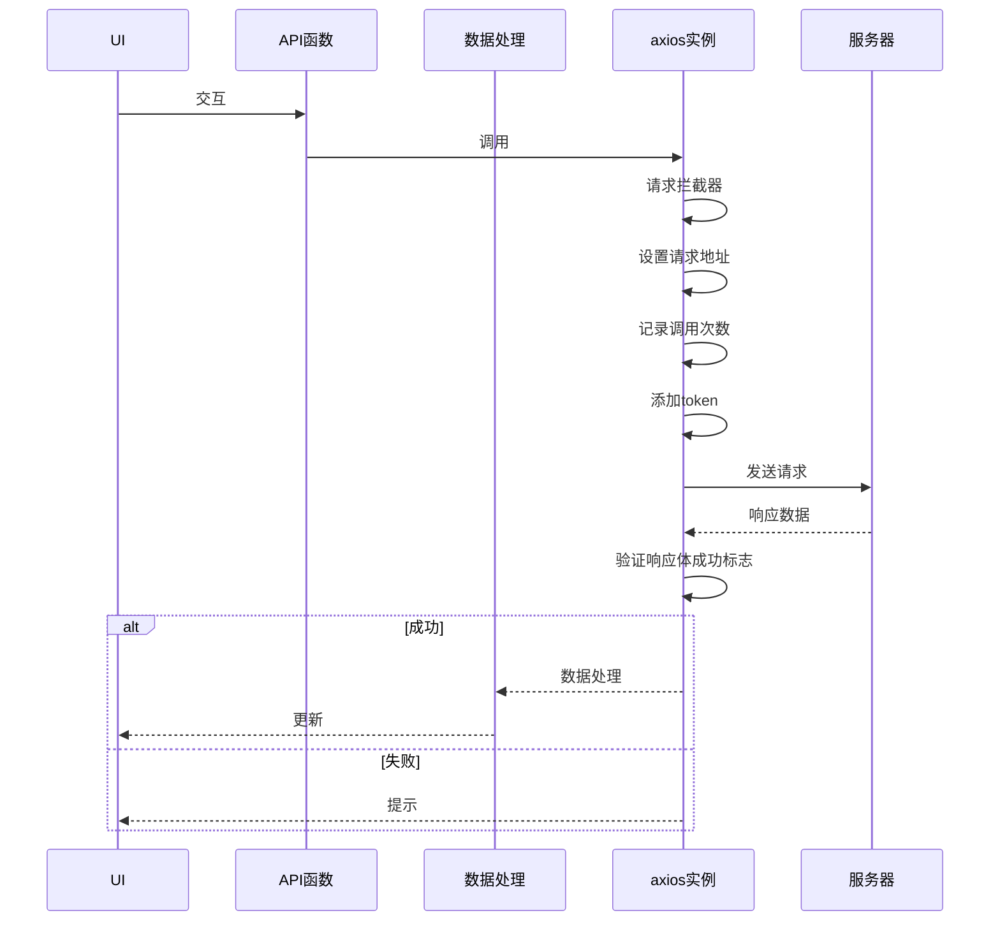
```mermaid
sequenceDiagram
	UI->>API函数:交互
	participant data as 数据处理
	API函数->>axios实例:调用
	axios实例->>axios实例:请求拦截器
	axios实例->>axios实例:设置请求地址
	axios实例->>axios实例:记录调用次数
	axios实例->>axios实例:添加token
	axios实例->>服务器:发送请求
	服务器-->>axios实例:响应数据
	axios实例->>axios实例:验证响应体成功标志
	alt 成功
	axios实例-->>data:数据处理
	data-->>UI:更新
	else 失败
	axios实例-->>UI:提示
	end
```

## Mock与数据模拟

由于前后端交替迭代的事实，基于前后端分离的设计标准. Mock数据是分离开发的关键，通过完整的请求数据和逻辑模拟能够让前端开发更加独立，不会被后端开发阻塞. 

一般使用Mock.js完成前端模拟. 所有请求都会被它拦截并代理到本地，然后进行数据模拟. 不过Mock.js会重写浏览器XMLHttpRequest对象，造成一些底层依赖XMLHttpRequest的库不兼容. 并且本地代理链路模拟数据，浏览器监听不到任务网络请求，这对于前端接口调试十分不友好. 

所以本项目使用mock-server方案进行模拟. 该方案完全基于webpack-dev-serve实现，启动调试的同时，mock-server会附加启动. 并且使用chokidar监视mock代码编码，支持热重载. 由于这是一个真正的服务器，在保留了Mock.js优势的同时，解决了浏览器XMLHttpRequest对象的问题，也可以通过DevTools调试网络请求. 还可以附加多个mock-server，来进行多后端模拟. 

# 接口信息

## 用户操作

| 接口名       | 接口URL                  | 入参                   |
| :----------- | :----------------------- | :--------------------- |
| 用户登陆     | localhost:7784/DCLogin   | "userID": ""           |
|              |                          | "userPwd": ""          |
| 用户信息查看 | localhost:7784/DCUserQry | 无                     |
|              |                          |                        |
| 用户信息修改 | localhost:7784/DCUserMod | "mobileTel": "",//电话 |
|              |                          | "eMail": "",//邮箱     |

## 服务公告

| 接口名               | 接口URL                      | 入参                        |
| :------------------- | :--------------------------- | :-------------------------- |
| 服务公告信息新增     | localhost:7784/DCServerAdd   | "server_name": "", //服务名 |
|                      |                              | "server_type": "", //类别   |
|                      |                              | "httpinfo": "", // 链接     |
|                      |                              | "remark": "", // 描述       |
|                      |                              | "keywords": ""//关键词      |
| 服务公告信息修改     | localhost:7784/DCServerMod   | "server_name": "", //服务名 |
|                      |                              | "server_type": "", //类别   |
|                      |                              | "httpinfo": "", // 链接     |
|                      |                              | "remark": "", // 描述       |
|                      |                              | "keywords": ""//关键词      |
| 服务公告信息删除     | localhost:7784/DCServerDel   | "server_name": "", //服务名 |
|                      |                              |                             |
| 所有服务公告信息查询 | localhost:7784/DCServerQuery | 无                          |
|                      |                              |                             |

## 值班系统

| 接口名                               | 接口URL                              | 入参                                                         |
| :----------------------------------- | :----------------------------------- | :----------------------------------------------------------- |
| 新增值班计划                         | localhost:7784/addOnDutyInfo         | "duty_name": "", // 值班名称                                 |
|                                      |                                      | "group_name": "", // 钉钉组名                                |
|                                      |                                      | "people_count": 1, // 一天值班人数                           |
|                                      |                                      | "duty_msg": "", // 值班提示语                                |
|                                      |                                      | "duty_people": "", // 值班人员名单                           |
|                                      |                                      | "userID": "", // 用户编号                                    |
|                                      |                                      | "pub_notice_week": "", // 公告计划                           |
|                                      |                                      | "auto_skip": 0, // 智能跳过法定节假日                        |
|                                      |                                      | "self_holiday": "", // 自定义节假日                          |
|                                      |                                      | "group_name2": "" // 任务所属组别                            |
| 修改值班计划                         | localhost:7784/modOnDutyInfo         | "duty_name": "", // 值班名称                                 |
|                                      |                                      | "group_name": "", // 钉钉组名                                |
|                                      |                                      | "people_count": 1, // 一天值班人数                           |
|                                      |                                      | "duty_msg": "", // 值班提示语                                |
|                                      |                                      | "duty_people": "", // 值班人员名单                           |
|                                      |                                      | "pub_notice_week": "", // 公告计划                           |
|                                      |                                      | "auto_skip": 0, // 智能跳过法定节假日                        |
|                                      |                                      | "self_holiday": "", // 自定义节假日                          |
|                                      |                                      | "flag":true //更改了auto_skip self_holiday people_count和duty_people需要 |
| 删除值班计划                         | localhost:7784/delOnDutyInfo         | "duty_name": "", // 值班名称                                 |
|                                      |                                      |                                                              |
| 查询所有值班计划                     | localhost:7784/getAllOnDutyInfo      | 无                                                           |
|                                      |                                      |                                                              |
|                                      |                                      |                                                              |
|                                      |                                      |                                                              |
| 查询用户值班计划主表                 | localhost:7784/getOnDutyInfo         | "userID":""//用户编号                                        |
|                                      |                                      |                                                              |
| 查询值班名值班计划                   | localhost:7784/ getOnDutyInfoByName  | "duty_name":""//值班名                                       |
|                                      |                                      |                                                              |
| 查询所属组别全部值班计划主表         | localhost:7784/ getOnDutyInfoByGroup | "group_name2":""// 任务所属组别                              |
|                                      |                                      |                                                              |
| 查询某值班任务临时值班表所有值班信息 | localhost:7784/QuryTmpDuty           | "dutyName": "", // 对应DCONDUTY表中DUTY_NAME                 |
|                                      |                                      |                                                              |
| 修改临时值班表                       | localhost:7784/UpTmpDuty             | "dutyName": "测试值班助手", // 名称                          |
|                                      |                                      | "date": "2022-05-03", //待修改日期 注意日期位数              |
|                                      |                                      | "newPeople": [ "456","12312" ], // 新值班人员钉钉号列表      |

## 人员列表查询

| 接口名                     | 接口URL                                  | 入参                     |
| :------------------------- | :--------------------------------------- | :----------------------- |
| 查询钉钉人员信息           | localhost:7784/getDingPersonInfo         | 无                       |
|                            |                                          |                          |
| 根据组别查询工号和姓名列表 | localhost:7783/user/getUserNNBygroupName | "groupName":""//组别名称 |
|                            |                                          |                          |
|                            |                                          |                          |

## 权限控制

### 组别表查询

| 接口名               | 接口URL                                  | 入参                            |
| :------------------- | :--------------------------------------- | :------------------------------ |
| 添加组别             | localhost:7783/group/createGroup         | "groupName":"",//组别名称       |
|                      |                                          | "groupDescription":""//组别描述 |
|                      |                                          |                                 |
| 删除组别             | localhost:7783/group/deleteGroupByName   | "groupName":""//组别名称        |
|                      |                                          |                                 |
|                      |                                          |                                 |
| 修改组别             | localhost:7783/group/updateGroup         | "groupName":"",//组别名称       |
|                      |                                          | "groupDescription":""//组别描述 |
|                      |                                          |                                 |
| 查询全部组别         | localhost:7783/group/retrieveAllGroup    | 无                              |
|                      |                                          |                                 |
|                      |                                          |                                 |
| 根据组别名称查询组别 | localhost:7783/group/retrieveGroupByName | "groupName":""//组别名称        |
|                      |                                          |                                 |
|                      |                                          |                                 |

## 任务调度功能

说明:

- 调用方法:使用本机接口调用的方法，参数必须为java基本数据类型:int、short、long、float、double、char、boolean、String、Integer、Short、Long、Float、Double、Character、Booleand，不支持其他类型的参数，参数可以有多个，但是必须按照方法参数的声明顺序传入. 

接口会根据传入的方法名及参数来自动判断调用哪个方法，支持重载的方法.  不支持私有方法的调用，但支持静态方法的调用. 

- cmd命令:将黑框输入的内容写入task字段即可. 

| 接口名               | 接口URL                                      | 入参                                                         |
| :------------------- | :------------------------------------------- | :----------------------------------------------------------- |
| 创建任务调度         | localhost:7783/timedTask/createTask          | "userID": "", // 用户ID                                      |
|                      |                                              | "task": "", //任务内容 即要调用的函数方法，格式为“全类名 + 方法名” |
|                      |                                              | "taskType": "", //任务类型，“0”表示cmd命令，“1”表示调用方法  |
|                      |                                              | "taskAlias":"",//任务唯一标识，若不传入则自动生成随机标识    |
|                      |                                              | "cron": "", //Cron表达式，用于指定调用频率                   |
|                      |                                              | "startTime": "", //开始调用的时间                            |
|                      |                                              | "endTime": "", //结束调用的时间                              |
|                      |                                              | "params": "" //传入的参数，整体为列表结构，其中每一个参数为键值对形式，键为数据类型，值为数值. 参数可以有多个，但是必须按照方法参数的声明顺序传入，且参数类型需要一一对应. |
| 启动任务调度         | localhost:7783/timedTask/startTask           | "userID": "", // 用户ID                                      |
|                      |                                              | "taskAlias": "" //任务别名                                   |
|                      |                                              |                                                              |
| 停止任务调度         | ocalhost:7783/timedTask/stopTask             | "userID": "", // 用户ID                                      |
|                      |                                              | "taskAlias": "" //任务别名                                   |
|                      |                                              |                                                              |
| 删除任务调度         | localhost:7783/timedTask/deleteTask          | "userID": "", // 用户ID                                      |
|                      |                                              | "taskAlias": "" //任务别名                                   |
|                      |                                              |                                                              |
| 更新任务调度         | localhost:7783/timedTask/updateTask          | "userID": "", // 用户ID                                      |
|                      |                                              | "taskAlias": "", //已经在运行的任务名                        |
|                      |                                              | "cron": "", //Cron表达式，用于指定调用频率                   |
|                      |                                              | "startTime": "", //开始调用的时间                            |
|                      |                                              | "endTime": "" //结束调用的时间                               |
| 查询全部任务         | localhost:7783/timedTask/retrieveAllTasks    | 无                                                           |
|                      |                                              |                                                              |
|                      |                                              |                                                              |
| 查询指定任务调度     | localhost:7783/timedTask/retrieveTaskByAlias | "taskAlias": ""//任务别名                                    |
| 查询对应任务全部日志 | localhost:7783/timedTask/retrieveLogs        | "taskName": "",//任务内容                                    |
|                      |                                              | "taskAlias": "",//任务别名                                   |
|                      |                                              | "pageNum": "",//对应页数                                     |
|                      |                                              | "rowNum": ""//每页条数                                       |
| 查询最新的n条日志    | localhost:7783/timedTask/retrieveLogs        | "recentCount": "",//要查询的最新的记录数 (recentCount为0时查询全部) |
|                      |                                              | "pageNum": "",//对应页数                                     |
|                      |                                              | "rowNum": ""//每页条数                                       |
| 删除全部日志         | localhost:7783/timedTask/deleteLogs          | 无                                                           |
| 删除对应别名的日志   | localhost:7783/timedTask/deleteLogByAlias    | "taskAlias": ""//任务别名                                    |
| 删除最旧的n条日志    | localhost:7783/timedTask/deleteLogs          | "oldestCount": ""//要删除的最旧的日志记录数                  |

## 系统配置

| 接口名                       | 接口URL                                  | 入参                                      |
| :--------------------------- | :--------------------------------------- | :---------------------------------------- |
| 查询全部系统配置             | localhost:7783/variable/retrieveVariable | 无                                        |
| 根据变量名精准查询系统配置   | localhost:7783/variable/retrieveVariable | "variableName": ""//要查询配置的配置名    |
| 根据别名精准查询系统配置     | localhost:7783/variable/retrieveVariable | "variableAlias": ""//要查询配置的配置别名 |
| 根据变量名或变量别名模糊查询 | localhost:7783/variable/fuzzyVariable    | "variableAlias": "",//配置别名（非必需）  |
|                              |                                          | "variableName": ""//配置名（非必需）      |
| 添加系统配置                 | localhost:7783/variable/createVariable   | "variableAlias": "",//配置别名            |
|                              |                                          | "variableName": "",//配置名（必需）       |
|                              |                                          | "variableValue": "",//配置的数值（必需）  |
|                              |                                          | "variableDescription": ""//配置说明       |
| 删除系统配置                 | localhost:7783/variable/deleteVariable   | "variableName": ""//配置名                |
| 更新系统变量                 | localhost:7783/variable/updateVariable   | "variableAlias": "",//配置别名            |
|                              |                                          | "variableName": "",//配置名（必需）       |
|                              |                                          | "variableValue": "",//配置的数值（必需）  |
|                              |                                          | "variableDescription": ""//配置说明       |

## 钉钉机器人信息

| 接口名             | 接口URL                                   | 入参                                                         |
| :----------------- | :---------------------------------------- | :----------------------------------------------------------- |
| 钉钉机器人信息新增 | localhost:7783/dingTalk/insertDingTalk    | "webHook": "",//钉钉机器人的WebHook地址（String）            |
|                    |                                           | "groupName": "",//机器人所属群组名（String）自取名，非用户组别 |
|                    |                                           | "secret": "",//钉钉机器人加签后的密钥（String）              |
| 钉钉机器人信息删除 | localhost:7783/dingTalk/deleteDingTalk    | "groupName": ""//机器人所属群组名（String）自取名，非用户组别 |
| 钉钉机器人信息修改 | localhost:7783/dingTalk/updateDingTalk    | "groupName": "",//机器人所属群组名（String）自取名，非用户组别 |
|                    |                                           | "webHook": "",//钉钉机器人的WebHook地址（String）            |
|                    |                                           | "secret": "",//钉钉机器人加签后的密钥（String）              |
| 钉钉机器人查询全部 | localhost:7783/dingTalk/selectAllDT       | 无                                                           |
| 钉钉机器人指定查询 | localhost:7783/dingTalk/selectByGroupName | "groupName":""//机器人所属群组名（String）自取名，非用户组别 |

# 数据库表结构与图

**数据库信息**:Oracle11g Dockers

- 用户名:jn_asset

- 密码:123

- 服务名:orcl

**注意:表结构字段前加*号表示该字段为系统自动填充字段，前端不应该操作. **

## 数据表总览

			<!--块级封装-->
    
	<!--将图片和文字居中-->
    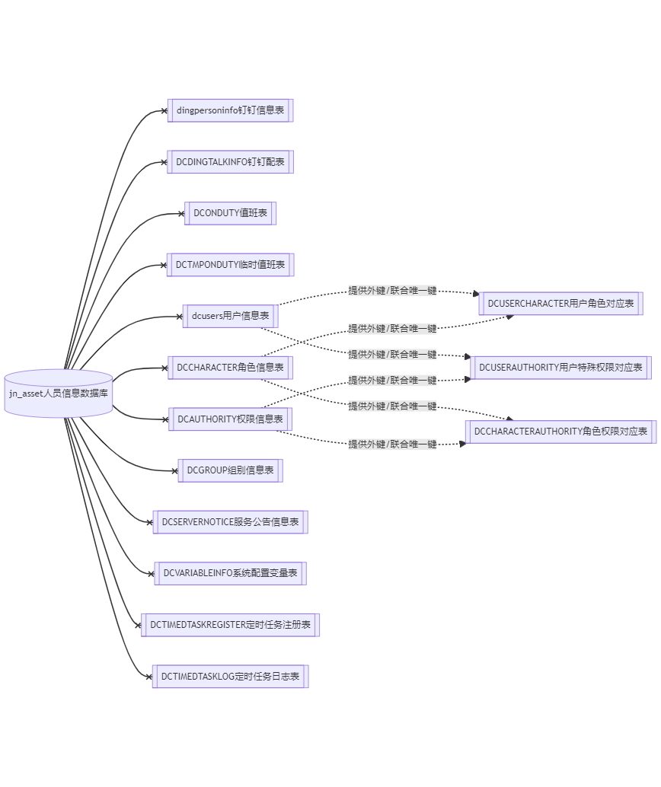
     		<!--换行-->
    

## ER实体关系图

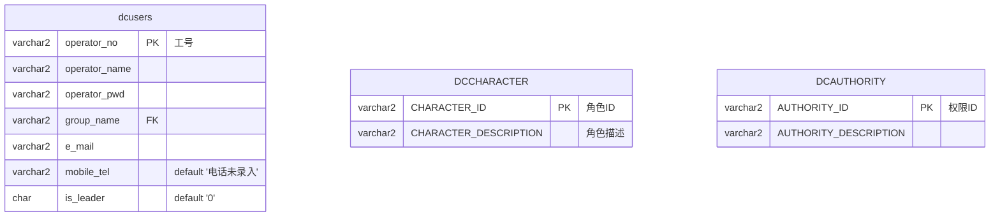
```mermaid
erDiagram
    dcusers {
        varchar2 operator_no PK "工号"
        varchar2 operator_name
        varchar2 operator_pwd
        varchar2 group_name FK
        varchar2 e_mail
        varchar2 mobile_tel "default '电话未录入'"
        char is_leader "default '0'"
    }
    DCCHARACTER {
    	varchar2 CHARACTER_ID PK "角色ID"
    	varchar2 CHARACTER_DESCRIPTION "角色描述"
    }
    DCAUTHORITY {
    	varchar2 AUTHORITY_ID PK "权限ID"
    	varchar2 AUTHORITY_DESCRIPTION
    }
```

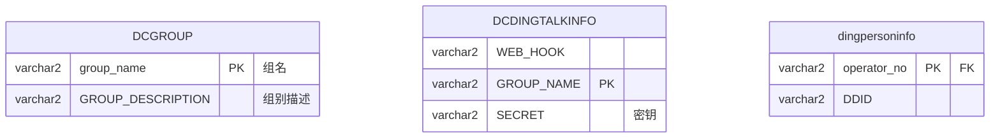
```mermaid
erDiagram
	DCGROUP {
		varchar2 group_name PK "组名"
		varchar2 GROUP_DESCRIPTION "组别描述"
	}
    DCDINGTALKINFO {
    	varchar2 WEB_HOOK  ""
    	varchar2 GROUP_NAME PK
    	varchar2 SECRET "密钥"
    }
    dingpersoninfo {
    	varchar2 operator_no PK "FK"
    	varchar2 DDID
    }

```

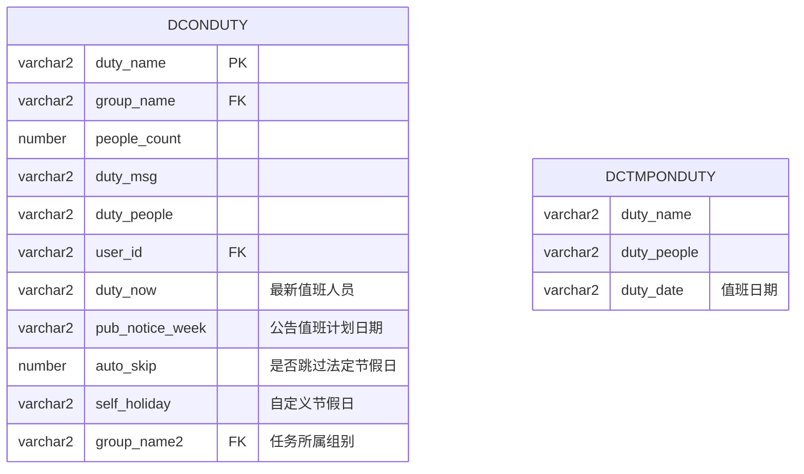
```mermaid
erDiagram
	DCONDUTY {
    	varchar2 duty_name PK 
    	varchar2 group_name FK
    	number people_count
    	varchar2 duty_msg
    	varchar2 duty_people
    	varchar2 user_id FK
    	varchar2 duty_now "最新值班人员"
    	varchar2 pub_notice_week "公告值班计划日期"
    	number auto_skip "是否跳过法定节假日"
    	varchar2 self_holiday "自定义节假日"
    	varchar2 group_name2 FK "任务所属组别"
    }
    DCTMPONDUTY {
    	varchar2 duty_name
    	varchar2 duty_people
    	varchar2 duty_date "值班日期"
    }

```

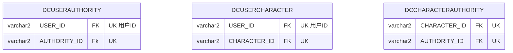
```mermaid
erDiagram
    DCUSERAUTHORITY {
    	varchar2 USER_ID FK "UK 用户ID"
    	varchar2 AUTHORITY_ID Fk "UK"
    }
	DCUSERCHARACTER {
    	varchar2 USER_ID FK "UK 用户ID"
    	varchar2 CHARACTER_ID FK "UK"
    }
    DCCHARACTERAUTHORITY {
    	varchar2 CHARACTER_ID FK "UK"
    	varchar2 AUTHORITY_ID FK "UK"
    }
    
```

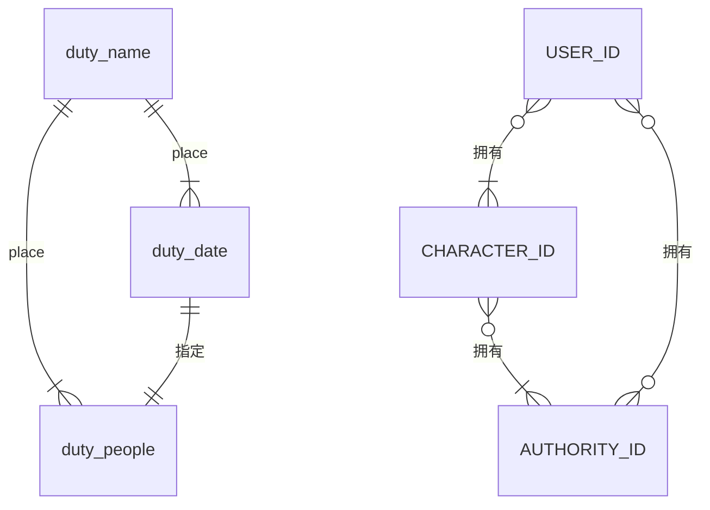
```mermaid
erDiagram

    duty_name ||--|{ duty_people : place
    duty_name ||--|{ duty_date : place
    duty_date ||--|| duty_people : "指定"
    CHARACTER_ID }o--|{ AUTHORITY_ID : "拥有"
    USER_ID }o--o{ AUTHORITY_ID : "拥有"
	USER_ID }o--|{ CHARACTER_ID : "拥有"
```

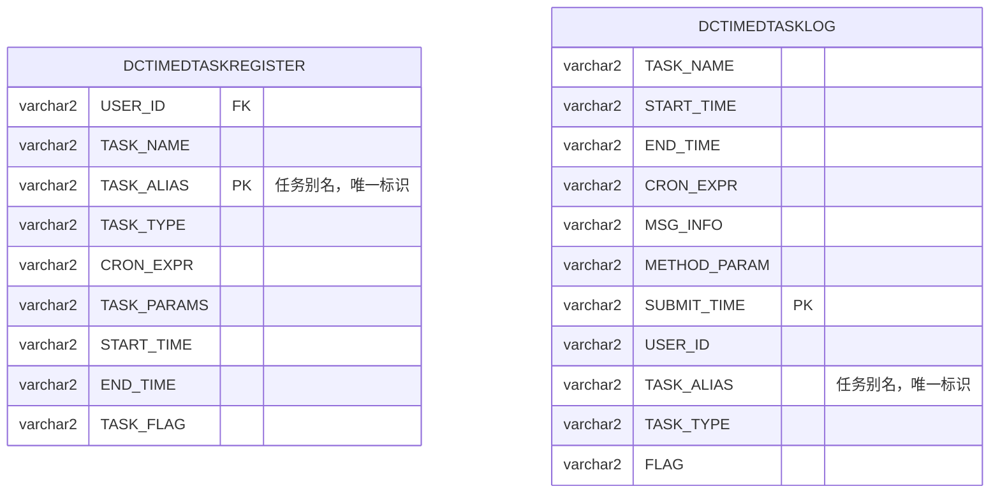
```mermaid
erDiagram
	DCTIMEDTASKREGISTER{
		varchar2 USER_ID FK
		varchar2 TASK_NAME
		varchar2 TASK_ALIAS PK "任务别名，唯一标识"
		varchar2 TASK_TYPE
		varchar2 CRON_EXPR
		varchar2 TASK_PARAMS
		varchar2 START_TIME
		varchar2 END_TIME
		varchar2 TASK_FLAG
	}
	DCTIMEDTASKLOG{
		varchar2 TASK_NAME
		varchar2 START_TIME
		varchar2 END_TIME 
		varchar2 CRON_EXPR
		varchar2 MSG_INFO
		varchar2 METHOD_PARAM
		varchar2 SUBMIT_TIME PK
		varchar2 USER_ID
		varchar2 TASK_ALIAS "任务别名，唯一标识"
		varchar2 TASK_TYPE
		varchar2 FLAG
	}
```

## 表结构

### 用户信息表:dcusers  

| 字段名        | 类型         | 键   | 描述     |
| ------------- | ------------ | ---- | -------- |
| operator_no   | varchar2(10) | PK   | 工号     |
| operator_name | varchar2(50) |      | 姓名     |
| operator_pwd  | varchar2(50) |      | 密码     |
| group_name    | varchar2(10) | FK   | 组名     |
| e_mail        | varchar2(50) |      | 邮箱地址 |
| mobile_tel    | varchar2(20) |      | 联系电话 |
| is_leader     | char(1)      |      | 是否领导 |

### 组别信息表(DCGROUP)

| 字段名            | 类型          | 键   | 描述     |
| ----------------- | ------------- | ---- | -------- |
| group_name        | varchar2(10)  | PK   | 组名     |
| GROUP_DESCRIPTION | varchar2(100) |      | 组名描述 |

>

### 角色信息表(DCCHARACTER)

| 字段名                | 类型          | 键   | 描述     |
| --------------------- | ------------- | ---- | -------- |
| CHARACTER_ID          | varchar2(10)  | PK   | 角色ID   |
| CHARACTER_DESCRIPTION | varchar2(100) |      | 角色描述 |

### 权限信息表(DCAUTHORITY)

| 字段名                | 类型          | 键   | 描述     |
| --------------------- | ------------- | ---- | -------- |
| AUTHORITY_ID          | varchar2(10)  | PK   | 权限ID   |
| AUTHORITY_DESCRIPTION | varchar2(100) |      | 权限描述 |

### 角色权限对应表(DCCHARACTERAUTHORITY)

| 字段名       | 类型         | 键    | 描述   |
| ------------ | ------------ | ----- | ------ |
| CHARACTER_ID | varchar2(10) | UK FK | 角色ID |
| AUTHORITY_ID | varchar2(10) | UK FK | 权限ID |

 

### 用户角色对应表(DCUSERCHARACTER)

| 字段名       | 类型         | 键    | 描述   |
| ------------ | ------------ | ----- | ------ |
| USER_ID      | varchar2(10) | UK FK | 用户ID |
| CHARACTER_ID | varchar2(10) | UK FK | 角色ID |

 

### 用户特殊权限对应表(DCUSERAUTHORITY)

| 字段名       | 类型         | 键    | 描述   |
| ------------ | ------------ | ----- | ------ |
| USER_ID      | varchar2(10) | UK FK | 用户ID |
| AUTHORITY_ID | varchar2(10) | UK FK | 权限ID |

### 钉钉配表（DCDINGTALKINFO）

| 字段       | 类型          | 键   | 描述     |
| ---------- | ------------- | ---- | -------- |
| WEB_HOOK   | varchar2(150) |      | webhook  |
| GROUP_NAME | varchar2(20)  | PK   | 钉钉组名 |
| SECRET     | varchar2(100) |      | 密钥     |

### 值班表(DCONDUTY)

| 字段            | 类型          | 键   | 描述               |
| --------------- | ------------- | ---- | ------------------ |
| duty_name       | varchar2(20)  | PK   | 值班名             |
| group_name      | varchar2(20)  | FK   | 钉钉组名           |
| people_count    | number(2,0)   |      | 一天值班人数       |
| duty_msg        | varchar2(100) |      | 值班提示           |
| duty_people     | varchar2(200) |      | 值班人员列表       |
| *user_id        | varchar2(10)  | FK   | 注册用户id         |
| *duty_now       | varchar2(10)  |      | 最新值班人员       |
| pub_notice_week | varchar2(5)   |      | 公告值班计划日期   |
| auto_skip       | NUMBER(1)     |      | 智能跳过法定节假日 |
| self_holiday    | VARCHAR2(10)  |      | 自定义节假日       |
| *grou_name2     | varchar2(10)  | FK   | 该任务所属组别     |

### 临时值班表(DCTMPONDUTY)

| 字段        | 类型          | 键   | 描述                 |
| ----------- | ------------- | ---- | -------------------- |
| duty_name   | varchar2(50)  |      | 值班名               |
| duty_people | varchar2(100) |      | 值班人员（单个人员） |
| duty_date   | varchar2(10)  |      | 值班日期             |

### 钉钉信息表(dingpersoninfo)

| 字段        | 类型         | 键    | 描述   |
| ----------- | ------------ | ----- | ------ |
| operator_no | varchar2(10) | PK FK | 工号   |
| DDID        | varchar2(20) |       | 钉钉id |

### 任务调度注册表（DCTIMEDTASKREGISTER）

| 字段名      | 类型         | 键   | 描述                              |
| ----------- | ------------ | ---- | --------------------------------- |
| USER_ID     | varchar2(10) | FK   | 操作者ID                          |
| TASK_NAME   | varchar2(50) |      | 任务内容                          |
| TASK_ALIAS  | varchar2(30) | PK   | 任务别名，唯一标识                |
| TASK_TYPE   | varchar2(1)  |      | 任务类型，“0”表示cmd，“1”表示方法 |
| CRON_EXPR   | varchar2(20) |      | Cron表达式                        |
| TASK_PARAMS | varchar2(20) |      | 调用方法的参数列表                |
| START_TIME  | varchar2(20) |      | 开始时间                          |
| END_TIME    | varchar2(20) |      | 结束时间                          |
| TASK_FLAG   | varchar2(1)  |      | 启动状态                          |

### 任务调度日志表（DCTIMEDTASKLOG）

| 字段名       | 类型         | 键   | 描述                   |
| ------------ | ------------ | ---- | ---------------------- |
| TASK_NAME    | varchar2(50) |      | 调用的方法名           |
| START_TIME   | varchar2(20) |      | 任务开始执行循环的时间 |
| END_TIME     | varchar2(20) |      | 任务结束执行循环的时间 |
| CRON_EXPR    | varchar2(20) |      | Cron表达式             |
| MSG_INFO     | varchar2(50) |      | 本次调用的结果         |
| METHOD_PARAM | varchar2(20) |      | 调用方法的参数列表     |
| SUBMIT_TIME  | varchar2(20) | PK   | 提交任务的时间         |
| USER_ID      | varchar2(10) |      | 操作者ID               |
| TASK_ALIAS   | varchar2(30) |      | 任务别名               |
| TASK_TYPE    | varchar2(1)  |      | 任务类型               |
| FLAG         | varchar(1)   |      | 启动状态               |

### 系统配置变量表（DCVARIABLEINFO）

| 关键字               | 类型         | 键   | 描述               |
| -------------------- | ------------ | ---- | ------------------ |
| VARIABLE_NAME        | varchar2(30) | PK   | 变量名（全局唯一） |
| VARIABLE_ALIAS       | varchar2(30) |      | 变量别名           |
| VARIABLE_VALUE       | varchar2(20) |      | 变量值             |
| VARIABLE_DESCRIPTION | varchar2(50) |      | 变量描述           |

### 服务公告信息:dcservernotice

| 字段名      | 类型          | 键   | 描述                                                         |
| ----------- | ------------- | ---- | ------------------------------------------------------------ |
| server_name | varchar2(20)  | PK   | Server服务名                                                 |
| server_type | number(1,0)   |      | Server服务类别  （暂定0为 文本，httpinfo字段会和remark一起放在文本中；1为图片展示，httpinfo内的链接会被做成Carousel 走马灯,remark会被忽略；2混杂，remark会所为文本放入，httpinfo的链接会作为图片） |
| httpinfo    | varchar2(500) |      | http链接地址                                                 |
| remark      | varchar2(300) |      | Server服务描述                                               |
| keywords    | varchar2(50)  |      | 自定义关键字                                                 |

# 结论与展望

## 总结

本文首先介绍了疫情时代用户需求与痛点，之后在现代Web项目开发框架下进一步研究解决方案，实现了一个权限设计完善，页面操作简单，UI设计友好，负载均衡，网络请求安全的渐进式Web应用. 

本文用到的技术均为现今主流Web应用开发技术，本文不仅遵循前后端分离的开发趋势，还详细介绍了开发流程中的重要部分，并且比较了不同解决方案的优劣. 使用基于微服务开发理念的Spring Boot和MyBatis框架，降低模块间耦合并且给数据库移植提供基础. 

项目按照实际业务需求划分为:任务调度，值班管理，权限验证三个系统和钉钉管理，权限设计模块，公告管理四个模块. 不同模块为各系统提供支持又彼此独立. 各系统直接相互依赖，数据流向明确，网络请求过程严谨，传输安全. 并且解决了跨域问题，方便服务多端部署. 

任务调度系统可以动态调整扫库频率，缓解服务器压力. 使用Quartz框架和多线程技术，并行处理数据，做到了秒级任务调度. 日志和监控功能对任务调度结果和错误实现追踪重现. 妥善的错误处理设置，确保尽可能多的交付调度任务. 

值班管理系统使用开源模块，智能判断法定节假日，实现了动态人员增减，自定义节假日，智能跳过法定节假日，自动钉钉消息通知，周计划发布的功能. 还可以动态修改值班安排，更新请假信息. 

权限验证系统对每个接口请求进行验证，配置了所有前端接口权限，实现了接口级权限控制，保证操作合法性. 权限设计分为角色，权限和特权部分，角色权限对应，用户均有相应角色和权限，方便批量管理和更改，还可以设置用户特权，满足一般角色的特殊用户需要. 

本项目总体设计思路明了，符合现代Web开发规范，设计模式与框架适应时代趋势，UI设计友好，学习成本低廉，较好的实现了开发之初提出的需求和痛点，完成了一个能够实际投入使用的企业级Web项目. 

## 工作展望

- 本项目只是对疫情时代组织或企业需求的初步实现，对于后续功能支持仍需迭代. 
- 由于技术问题，无法对该项目进行压力测试，不能清楚判断数据库设计优劣. 
- 由于本项目是内网项目，服务器安全方面有待提高. 
